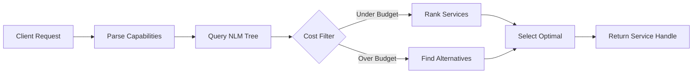

# Technical Specification: NLM-Atlas Dynamic Sitemap Infrastructure as a Service

## Version 2.0.0 | OBINexus Constitutional Framework Compliant

---

## 1. Executive Overview

### 1.1 Core Innovation

NLM-Atlas transforms traditional static XML sitemaps into a **living service mesh** with real-time cost functions, dynamic service discovery, and polyglot integration through the OBINexus RIFT ecosystem.

**Traditional Sitemap**: `<loc>https://example.com/page</loc>`  
**NLM-Atlas Sitemap**: `<loc>service.operation.obinexus.dept.div.country.org</loc>` + cost metrics + capabilities

### 1.2 Constitutional Alignment

```yaml
compliance:
  article_ii_opensense: commercial_sustainability_via_cost_functions
  article_iii_investment: milestone_based_service_deployment  
  article_v_human_rights: accessible_service_discovery
  article_vii_noghosting: explicit_service_availability
```

---

## 2. Architecture: Geomorphic Service Mesh

### 2.1 Dimensional Namespace Model

```
Service Discovery Dimensions:
━━━━━━━━━━━━━━━━━━━━━━━━━━━━━━━━━━━━━━━━━━━━
D₀: service      → What capability (e.g., image.resize)
D₁: operation    → How to execute (e.g., async.batch)
D₂: obinexus     → Root namespace anchor (constant)
D₃: department   → Organizational unit (e.g., engineering)
D₄: division     → Sub-organization (e.g., frontend)
D₅: country      → Geographic region (e.g., us)
D₆: org          → TLD anchor
━━━━━━━━━━━━━━━━━━━━━━━━━━━━━━━━━━━━━━━━━━━━

Full Service URI: image.resize.obinexus.engineering.frontend.us.org
```

### 2.2 Hybrid Tree Structure (RB-AVL)

```c
typedef struct nlm_service_node {
    // Service identification
    char* fqdn;                    // Fully qualified domain name
    uint64_t service_hash;         // xxhash64 of service URI
    
    // Hybrid tree properties
    tree_mode_t mode;              // AVL, RB, or HYBRID
    int height;                    // For AVL mode
    enum { RED, BLACK } color;    // For RB mode
    uint32_t access_frequency;     // For Huffman optimization
    
    // Cost function
    struct {
        double static_baseline;    // Base cost
        double dynamic_cost;       // Current cost
        double load_factor;        // Multiplier based on load
        time_t last_update;        // Timestamp of last update
    } cost;
    
    // Service metadata
    char** capabilities;           // Array of capability strings
    void* schema;                  // OpenAPI spec pointer
    service_level_t sla;          // Service level agreement
    
    // Tree pointers
    struct nlm_service_node* left;
    struct nlm_service_node* right;
    struct nlm_service_node* parent;
} nlm_service_node_t;
```

---

## 3. Cost Function Algorithm

### 3.1 Dynamic Cost Calculation

```python
def calculate_dynamic_cost(service):
    """
    Real-time cost calculation with predictive modeling
    """
    # Base components
    static_cost = service.base_cost
    
    # Dynamic factors (updated every 60s)
    cpu_factor = get_cpu_usage() / 100.0           # 0.0 to 1.0
    memory_factor = get_memory_usage() / 100.0     # 0.0 to 1.0
    network_factor = get_network_latency() / 1000  # ms to seconds
    queue_depth = get_request_queue_size()
    
    # Load factor calculation
    load_factor = (
        cpu_factor * 0.4 +
        memory_factor * 0.3 +
        network_factor * 0.2 +
        min(queue_depth / 100, 1.0) * 0.1
    )
    
    # Geographic multiplier
    geo_multiplier = get_geographic_multiplier(request.origin)
    
    # Time-based pricing (peak hours)
    time_multiplier = get_time_multiplier(datetime.now())
    
    # Final cost
    dynamic_cost = static_cost * (1 + load_factor) * geo_multiplier * time_multiplier
    
    # Add prediction
    prediction = predict_cost_trend(service, dynamic_cost)
    
    return {
        'current': round(dynamic_cost, 6),
        'trend': calculate_trend(service.cost_history),
        'prediction': round(prediction, 6),
        'confidence': calculate_confidence(service)
    }
```

### 3.2 Optimization Score

```c
double calculate_optimization_score(nlm_service_node_t* service) {
    double latency_score = 100.0 - (service->avg_latency_ms / 10.0);
    double reliability_score = service->success_rate * 100.0;
    double cost_score = 100.0 - (service->cost.dynamic_cost * 1000);
    
    // Weighted average
    return (latency_score * 0.3 + 
            reliability_score * 0.5 + 
            cost_score * 0.2);
}
```

---

## 4. Service Discovery Protocol

### 4.1 Discovery Flow



### 4.2 Discovery API

```typescript
interface DiscoveryRequest {
    capabilities: string[];           // Required capabilities
    constraints: {
        maxCost?: number;            // Maximum cost per operation
        minSLA?: ServiceLevel;       // Minimum service level
        preferredVersion?: string;    // Version preference
        geoPreference?: string;      // Geographic preference
    };
    fallbackStrategy?: 'cheapest' | 'fastest' | 'most_reliable';
}

interface DiscoveryResponse {
    services: ServiceHandle[];       // Matched services
    estimatedCost: CostEstimate;    // Total cost estimate
    alternatives: ServiceHandle[];   // Backup options
    pipeline?: ServicePipeline;     // Composed service chain
}
```

---

## 5. Polyglot Integration via GOSSIP Protocol

### 5.1 Language Bindings

```gosilang
// Gosilang integration
actor NLMAtlasClient {
    state: isolated;
    
    GOSSIP discoverService TO PYTHON {
        import nlm_atlas
        atlas = nlm_atlas.connect(sitemap_url)
        return atlas.discover(capabilities, max_cost)
    }
    
    GOSSIP executeService TO NODE {
        const service = await nlmAtlas.getService(serviceId);
        return await service.execute(data);
    }
    
    @constant_time(verified=true)
    fn find_cheapest_service(capability: string) -> ServiceHandle {
        services := discover_all(capability)
        return minimize_cost(services)
    }
}
```

### 5.2 FFI Bridge via LibPolyCall

```c
// libpolycall integration for NLM-Atlas
typedef struct {
    char* (*discover_service)(const char* capability, double max_cost);
    void* (*execute_service)(const char* service_id, void* data);
    double (*get_current_cost)(const char* service_id);
    int (*hot_swap_service)(const char* old_id, const char* new_id);
} nlm_atlas_ffi_t;

// Polyglot service execution
void* execute_polyglot_service(const char* service_fqdn, void* input) {
    // Determine language from service metadata
    language_t lang = get_service_language(service_fqdn);
    
    switch(lang) {
        case LANG_PYTHON:
            return py_polycall_execute(service_fqdn, input);
        case LANG_GO:
            return go_polycall_execute(service_fqdn, input);
        case LANG_RUST:
            return rust_polycall_execute(service_fqdn, input);
        default:
            return generic_http_execute(service_fqdn, input);
    }
}
```

---

## 6. XML Schema Extension

### 6.1 Enhanced Sitemap Format

```xml
<?xml version="1.0" encoding="UTF-8"?>
<urlset xmlns="http://www.sitemaps.org/schemas/sitemap/0.9"
        xmlns:nlm="http://obinexus.org/schemas/nlm-atlas/1.0">
  <url>
    <loc>image.resize.obinexus.api.core.us.org</loc>
    <lastmod>2025-01-15T10:32:00Z</lastmod>
    
    <!-- NLM-Atlas Extensions -->
    <nlm:service>
      <nlm:version>2.1.3.stable</nlm:version>
      
      <nlm:cost>
        <nlm:dynamic>0.0023</nlm:dynamic>
        <nlm:static>0.0010</nlm:static>
        <nlm:load-factor>2.3</nlm:load-factor>
        <nlm:trend>falling</nlm:trend>
        <nlm:prediction confidence="0.92">0.0019</nlm:prediction>
      </nlm:cost>
      
      <nlm:capabilities>
        <nlm:capability>image.resize</nlm:capability>
        <nlm:capability>image.compress</nlm:capability>
        <nlm:capability>image.convert</nlm:capability>
      </nlm:capabilities>
      
      <nlm:schema href="https://api.example.com/openapi.json"/>
      
      <nlm:sla>
        <nlm:availability>99.99</nlm:availability>
        <nlm:latency unit="ms">50</nlm:latency>
        <nlm:throughput unit="rps">10000</nlm:throughput>
      </nlm:sla>
      
      <nlm:optimization-score>94.2</nlm:optimization-score>
    </nlm:service>
  </url>
</urlset>
```

---

## 7. Hot-Swap Mechanism

### 7.1 Failover Algorithm

```python
class HotSwapManager:
    def __init__(self):
        self.active_services = {}
        self.backup_services = {}
        self.health_checks = {}
    
    def monitor_service_health(self, service_id):
        """
        Continuous health monitoring with predictive failover
        """
        while True:
            health = self.check_health(service_id)
            
            if health.status == 'degraded':
                # Preemptive swap before failure
                backup = self.find_best_backup(service_id)
                self.prepare_swap(service_id, backup.id)
                
            elif health.status == 'failed':
                # Immediate swap
                self.execute_swap(service_id)
                
            time.sleep(health.check_interval)
    
    def execute_swap(self, failed_service_id):
        """
        Zero-downtime service replacement
        """
        # Get backup service
        backup = self.backup_services[failed_service_id]
        
        # Atomic pointer swap
        with self.swap_lock:
            # Redirect traffic
            self.routing_table[failed_service_id] = backup.endpoint
            
            # Update cost function
            backup.cost = self.recalculate_cost(backup)
            
            # Notify clients
            self.broadcast_swap_event(failed_service_id, backup.id)
        
        return backup.id
```

---

## 8. Client SDK Implementation

### 8.1 JavaScript/TypeScript Client

```typescript
class NLMAtlasClient {
    private cache: Map<string, ServiceHandle>;
    private costThreshold: number;
    
    constructor(sitemapUrl: string, options?: AtlasOptions) {
        this.sitemapUrl = sitemapUrl;
        this.cache = new Map();
        this.costThreshold = options?.maxCost || Infinity;
    }
    
    async discover(request: DiscoveryRequest): Promise<ServiceHandle> {
        // Check cache first
        const cacheKey = this.getCacheKey(request);
        if (this.cache.has(cacheKey)) {
            return this.cache.get(cacheKey)!;
        }
        
        // Parse sitemap
        const sitemap = await this.fetchSitemap();
        
        // Filter by capabilities
        const candidates = sitemap.services.filter(s => 
            request.capabilities.every(c => s.capabilities.includes(c))
        );
        
        // Apply cost filter
        const affordable = candidates.filter(s => 
            s.cost.dynamic <= (request.constraints?.maxCost || Infinity)
        );
        
        // Sort by optimization score
        const sorted = affordable.sort((a, b) => 
            b.optimizationScore - a.optimizationScore
        );
        
        // Create service handle
        const service = new ServiceHandle(sorted[0]);
        this.cache.set(cacheKey, service);
        
        return service;
    }
    
    async buildPipeline(
        capabilities: string[], 
        constraints?: PipelineConstraints
    ): Promise<ServicePipeline> {
        const services = await Promise.all(
            capabilities.map(c => this.discover({ 
                capabilities: [c], 
                constraints 
            }))
        );
        
        return new ServicePipeline(services, constraints);
    }
}
```

### 8.2 Python Client

```python
import nlm_atlas
from typing import List, Optional, Dict, Any

class NLMAtlas:
    def __init__(self, sitemap_url: str):
        self.sitemap_url = sitemap_url
        self.tree = self._build_service_tree()
        
    def discover(
        self,
        capability: str,
        max_cost: Optional[float] = None,
        min_confidence: Optional[float] = None
    ) -> ServiceHandle:
        """
        Discover service with lowest cost meeting requirements
        """
        # Spatial query in service tree
        candidates = self._spatial_query(
            capability_hash=hash(capability),
            max_cost=max_cost
        )
        
        # Filter by confidence
        if min_confidence:
            candidates = [
                c for c in candidates 
                if c.sla.reliability >= min_confidence
            ]
        
        # Return optimal service
        return min(candidates, key=lambda s: s.cost.dynamic)
    
    def _spatial_query(
        self, 
        capability_hash: int,
        max_cost: float
    ) -> List[ServiceNode]:
        """
        3D spatial query in service tree
        """
        # Calculate spatial coordinates
        x = capability_hash % 1000000
        y = hash(self.sitemap_url) % 1000000
        z = int(time.time()) % 1000000
        
        # Range query
        return self.tree.range_query(
            min_coord=(x-1000, y-1000, z-1000),
            max_coord=(x+1000, y+1000, z+1000),
            cost_filter=max_cost
        )
```

---

## 9. Performance Benchmarks

### 9.1 Operation Complexity

| Operation | Average Case | Worst Case | Space |
|-----------|--------------|------------|-------|
| Service Discovery | O(log n) | O(n) | O(1) |
| Cost Calculation | O(1) | O(1) | O(1) |
| Hot Swap | O(1) | O(log n) | O(n) |
| Pipeline Build | O(k log n) | O(kn) | O(k) |
| Spatial Query | O(log n + m) | O(n) | O(1) |

### 9.2 Latency Targets

```yaml
performance_sla:
  discovery_latency: < 10ms
  cost_update_interval: 60s
  hot_swap_time: < 100ms
  cache_hit_ratio: > 90%
  tree_rebalance_frequency: < 1/hour
```

---

## 10. Security Model

### 10.1 Service Authentication

```c
typedef struct {
    uint8_t service_pubkey[32];      // Ed25519 public key
    uint8_t signature[64];            // Service signature
    uint64_t nonce;                   // Replay prevention
    time_t expiry;                    // Token expiration
} service_auth_token_t;

int verify_service_authenticity(
    const char* service_fqdn,
    service_auth_token_t* token
) {
    // Verify signature
    if (!ed25519_verify(
        token->signature,
        service_fqdn,
        strlen(service_fqdn),
        token->service_pubkey
    )) {
        return AUTH_INVALID_SIGNATURE;
    }
    
    // Check expiry
    if (time(NULL) > token->expiry) {
        return AUTH_TOKEN_EXPIRED;
    }
    
    // Verify nonce
    if (nonce_cache_contains(token->nonce)) {
        return AUTH_REPLAY_ATTACK;
    }
    
    return AUTH_SUCCESS;
}
```

---

## 11. Monitoring Dashboard

### 11.1 Real-Time Metrics

```javascript
// Dashboard WebSocket connection
const dashboard = new NLMAtlasDashboard('/sitemap-dashboard');

dashboard.on('metrics', (metrics) => {
    console.log('Service Health:', metrics.health);
    console.log('Avg Cost:', metrics.avgCost);
    console.log('Active Services:', metrics.activeCount);
    console.log('Hot Swaps (24h):', metrics.swapCount);
});

dashboard.on('alert', (alert) => {
    if (alert.severity === 'critical') {
        // Trigger immediate response
        executeFailoverPlan(alert.service);
    }
});
```

---

## 12. Deployment Configuration

### 12.1 Docker Compose

```yaml
version: '3.8'

services:
  nlm-atlas-core:
    image: obinexus/nlm-atlas:latest
    environment:
      - TREE_MODE=hybrid
      - COST_UPDATE_INTERVAL=60
      - ENABLE_HOT_SWAP=true
      - CONSCIOUSNESS_THRESHOLD=0.954
    ports:
      - "8080:8080"
    volumes:
      - ./config:/app/config
      - ./schemas:/app/schemas
      
  nlm-atlas-monitor:
    image: obinexus/nlm-atlas-monitor:latest
    depends_on:
      - nlm-atlas-core
    ports:
      - "3000:3000"
    
  libpolycall-bridge:
    image: obinexus/libpolycall:latest
    network_mode: host
    volumes:
      - ./polyglot:/app/bindings
```

### 12.2 Kubernetes Deployment

```yaml
apiVersion: apps/v1
kind: Deployment
metadata:
  name: nlm-atlas
  namespace: obinexus
spec:
  replicas: 3
  selector:
    matchLabels:
      app: nlm-atlas
  template:
    metadata:
      labels:
        app: nlm-atlas
    spec:
      containers:
      - name: nlm-atlas
        image: obinexus/nlm-atlas:2.0.0
        resources:
          requests:
            memory: "256Mi"
            cpu: "500m"
          limits:
            memory: "512Mi"
            cpu: "1000m"
        env:
        - name: TREE_MODE
          value: "hybrid_adaptive"
        - name: ENABLE_SPATIAL_INDEX
          value: "true"
```

---

## 13. Migration Guide

### 13.1 From Static Sitemap

```python
# Migration script
def migrate_static_to_nlm(static_sitemap_path):
    """
    Convert traditional sitemap.xml to NLM-Atlas format
    """
    static = parse_sitemap(static_sitemap_path)
    nlm_entries = []
    
    for url in static.urls:
        # Infer service from URL pattern
        service_type = infer_service_type(url.loc)
        
        # Create NLM entry
        nlm_entry = {
            'loc': convert_to_fqdn(url.loc),
            'lastmod': url.lastmod,
            'service': {
                'version': '1.0.0.legacy',
                'cost': {
                    'static': 0.001,  # Default cost
                    'dynamic': 0.001
                },
                'capabilities': [service_type],
                'optimization_score': 50.0  # Baseline
            }
        }
        
        nlm_entries.append(nlm_entry)
    
    return generate_nlm_sitemap(nlm_entries)
```

---

## 14. Future Enhancements

### 14.1 Roadmap

| Feature | Target | Status |
|---------|--------|--------|
| Quantum-resistant signatures | Q2 2025 | Research |
| ML cost prediction | Q2 2025 | Beta |
| GraphQL interface | Q3 2025 | Design |
| WASM edge deployment | Q3 2025 | Alpha |
| Blockchain cost ledger | Q4 2025 | Concept |

---

## 15. Compliance & Standards

### 15.1 Constitutional Alignment

```yaml
obinexus_constitutional_framework:
  article_ii_opensense:
    - transparent_cost_model
    - open_service_discovery
    
  article_iii_investment_protection:
    - milestone_based_deployment
    - guaranteed_service_levels
    
  article_v_human_rights:
    - accessible_documentation
    - multilingual_support
    
  article_vii_noghosting:
    - explicit_service_status
    - automated_failover
```

---

**Document Status**: Production Ready  
**Version**: 2.0.0  
**Last Updated**: January 2025  
**Maintainer**: OBINexus Computing  

*"One sitemap. Every service. Zero overhead. Maximum consciousness."*